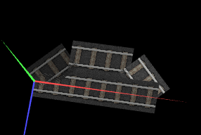
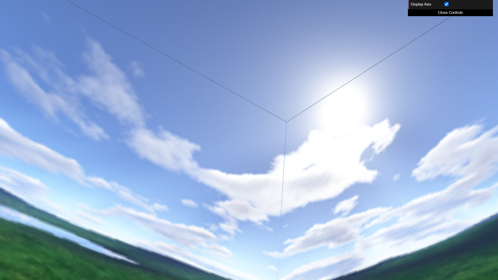
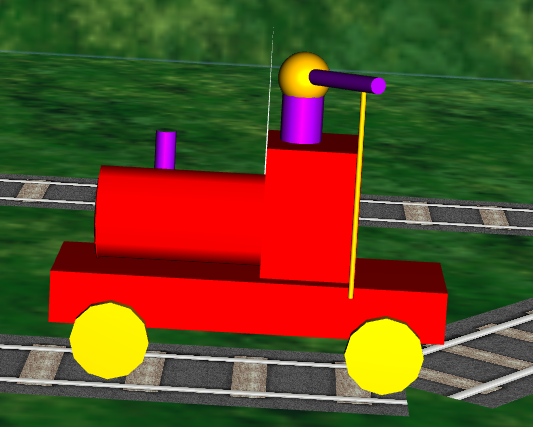
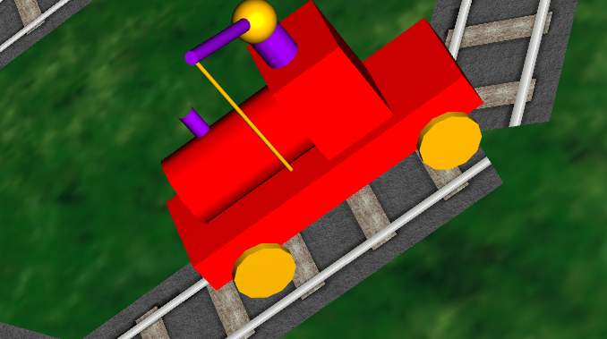
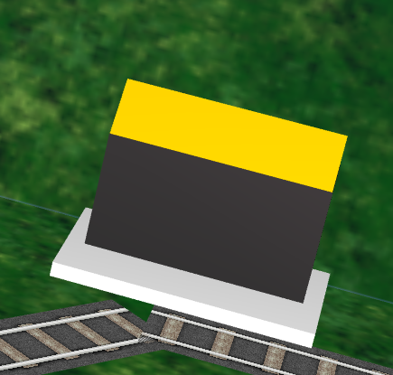
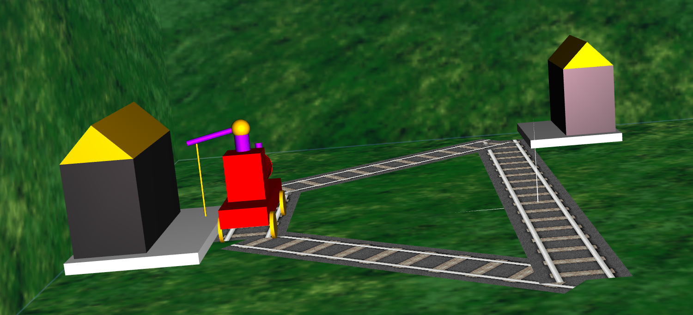

# CGRA 2021/2022

## Group T07G02

| Name             | Number    | E-Mail             |
| ---------------- | --------- | ------------------ |
| Ana Barbosa      | 201906704 | up201906704@up.pt  |
| Pedro Santos     | 201907254 | up201907254@up.pt  |

----

Não foram realizadas nenhumas das funcionalidades de valorização e, o guindaste, embora sendo totalmente e perfeitamente controlado pelo teclado, não consegue apanhar madeira.

----

- [Project](proj/README.md)